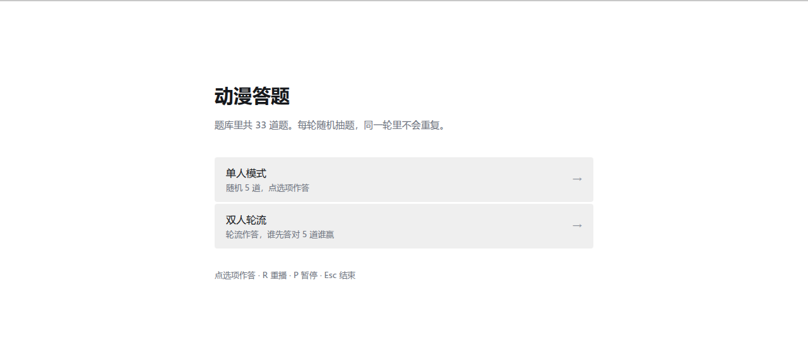
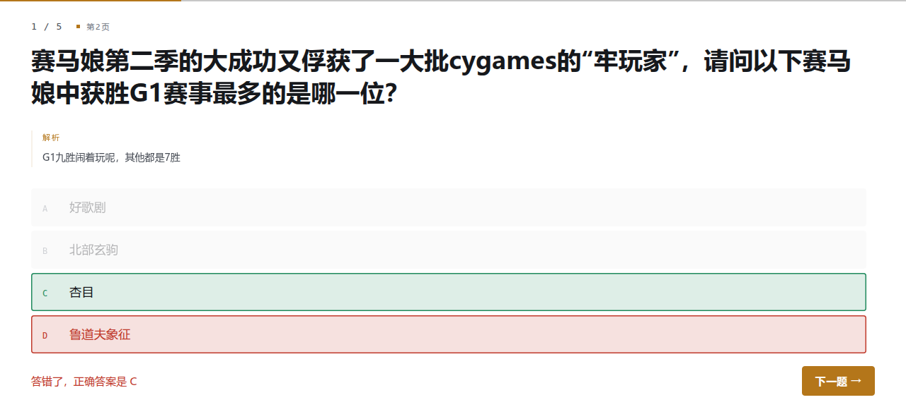
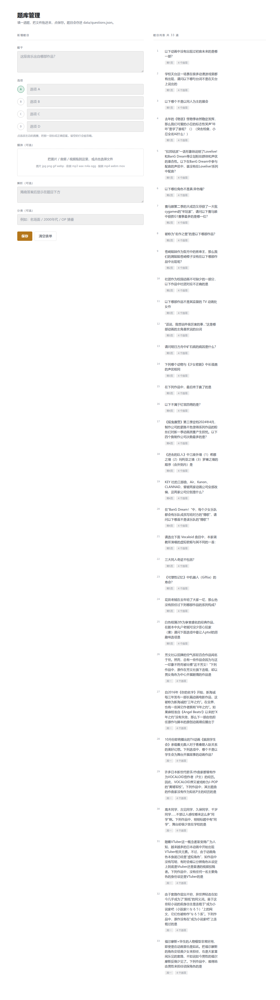

# 动漫答题放映器

一个跑在自己电脑上的小工具，用来办动漫答题活动。

不是答题 App，是**放映工具**——把题库放成全屏的答题现场，比 PPT 顺手：
题目和答案分开不会剧透、音乐只播你要的那一小段、加一道题不用排版。



<table>
<tr>
<td></td>
<td></td>
</tr>
<tr>
<td align="center">点选项作答，对错立刻看得见</td>
<td align="center">加题：填字、拖文件、保存</td>
</tr>
</table>

## 为什么不用 PPT

真的用 PPT 办过答题的话，这些应该都熟悉：

- 插进去的音乐只能从头播，没法只播副歌那 15 秒
- 想重播得手动拖进度条，现场手忙脚乱
- 换个电脑或换个文件夹，媒体全变红叉
- 题目和答案在同一页，或者翻页位置别扭，容易剧透
- 加一道题要重新排版、对准位置，改一次痛一次

这个工具就是把这些事做掉：媒体区间、重播、题答分离、加题只要粘字。

## 功能

- **四种题型**：纯文字、图片、音频、视频，一套引擎全支持
- **单人模式**：随机抽 5 道，点选项作答，结束报"答对几道"
- **双人轮流**：两人交替作答，答对加分、答错不扣分，先答对 5 道者赢
- **媒体区间**：音乐或视频只播你指定的几秒，按 R 随时重播这一段
- **图片打码**：可以设初始模糊，答案揭晓时自动变清晰
- **可视化加题**：浏览器里填表单、拖文件上传，一道题三十秒
- **浅色 / 深色**两套配色，一键切换
- **零依赖**：只用 Python 标准库，不需要 `pip install` 任何东西

## 快速开始

需要 Python 3（Windows 上没有的话去 python.org 装一个，安装时记得勾
"Add python.exe to PATH"）。

```bash
# Windows: 双击 start.bat
# WSL / Linux / macOS:
./start.sh
```

浏览器会自动打开。用完之后关掉那个终端窗口就行。

默认地址是 <http://127.0.0.1:8756>，端口被占用的话可以指定：

```bash
python server.py 9000
```

## 三个页面

| 地址 | 作用 |
|---|---|
| `/play` | 放映页，答题现场用这个（全屏按 F11） |
| `/admin` | 题库管理，加题、传媒体、改顺序 |
| `/` | 入口页，也能切换浅色/深色 |

## 怎么加题

打开 `/admin`：

1. 题干粘进去
2. 填四个选项，点选项左边的圆圈把正确项标出来
3. 媒体（可选）：把图片 / 音乐 / 视频拖进虚线框
   - 图片可以设"初始模糊"，放映时就是一张打码图
   - 音频视频传完后会出现播放条，点"设为起点""设为终点"就能限定只播某几秒
4. 解析、分类可填可不填
5. 点保存（Ctrl+S 也行）

页面下方列着所有题目，可以编辑、删除、↑↓ 调顺序。

## 答题时的操作

全部用鼠标点，键盘不用管：

- **点对了** → 那一项变绿
- **点错了** → 你点的那项变红，同时正确答案变绿
- 然后点右下角的「下一题」

键盘只负责媒体控制：

| 键 | 作用 |
|---|---|
| `R` | 重播这段媒体（只重播你定的那一段） |
| `P` | 暂停 / 继续 |
| `Esc` | 结束这一轮，回到开始界面 |

单人模式一轮 5 道；双人模式轮流作答，谁先答对 5 道谁赢（所以一局的题数不固定）。
这两个数字在 `web/play.js` 开头，`SINGLE_COUNT` 和 `DUO_TARGET`。

## 题目格式

题库就是一个 JSON 数组，放在 `data/questions.json`。一道题长这样：

```json
{
  "id": "q6aef8a940eee",
  "question": "这张图出自哪部作品？",
  "options": ["进击的巨人", "鬼灭之刃", "咒术回战", "电锯人"],
  "answer": 0,
  "explain": "答完之后显示的解析",
  "category": "看画面猜番",
  "media": {
    "kind": "image",
    "src": "media/xxx.jpg",
    "start": 0,
    "end": 0,
    "blur": 18
  }
}
```

| 字段 | 说明 |
|---|---|
| `answer` | 正确答案在 `options` 里的下标，从 0 开始 |
| `media` | 没有媒体的题可以整块去掉或写 `null` |
| `kind` | `image` / `audio` / `video` |
| `start` `end` | 音频视频的播放区间（秒），`end` 写 0 表示播到结尾 |
| `blur` | 图片初始模糊像素，0 表示清晰 |
| `category` | 放映时显示在左上角的小字，可以留空 |

存盘是「先写临时文件、再原子替换」，上一版会自动留成 `questions.json.bak`，
所以手滑写坏了还能捞回来。

## 文件结构

```
server.py              本地服务，纯标准库
start.bat / start.sh   启动脚本
data/questions.json    题库（纯文本，可以直接备份或拷走）
media/                 图片、音频、视频
web/                   前端页面
docs/                  README 用的截图
```

想备份或者搬到别的电脑，把整个文件夹复制过去就行，路径不会断。

## 投稿题目

欢迎往这里加题。最省事的方式是**开一个 Issue**：

1. 打开 [Issues → New issue](../../issues/new/choose)，选「投稿题目」
2. 出来的是一个可视化表单：题干、选项 A–D、正确答案（下拉选）、解析、分类
3. 填完提交

提交之后，仓库的 GitHub Action 会自动把它转成 `data/questions.json` 里的一道题，
并开一个 Pull Request，同时在 Issue 里回复 PR 链接。维护者审核一下、点个 merge 就进库了。

整个流程不需要投稿人懂 Git，也不需要懂 JSON。

如果你会 Git，也可以直接 fork 改 `data/questions.json` 提 PR，效果一样。

**媒体文件请不要提交到仓库**（见下面版权那节）。题目里要用图片的话，
`media.src` 写外链地址（`https://` 开头）也能播。

> 首次启用自动转换前，记得在仓库的
> Settings → Actions → General → Workflow permissions
> 里选上 **Read and write permissions**，否则那个 Action 没权限开 PR。

## 版权提醒（重要）

这个**工具本身**是开源的，随便用。

但你可能往里放的**内容**——动画截图、主题曲、视频片段——都是有版权的。
把大量版权素材放进公开仓库，是可能收到投诉的，严重时仓库会被下架。

所以：`media/` 已经写进 `.gitignore`，默认不会被提交。
自己本地用无所谓，要公开分享时注意一下。

## 常见问题

**放映页打不开 / 一直转圈**
本地服务没在跑。关掉窗口重新双击启动脚本。

**音频视频不出声**
浏览器要求页面先有一次点击才能出声。点一下别的地方再按 R 重播。

**显示"媒体文件找不到"**
`media` 文件夹里那个文件被删了或者改名了。重新传一次，或把文件名改回去。

**端口被占用**
换个端口：`python server.py 9000`，然后手动打开 `http://127.0.0.1:9000/play`

## 许可

MIT
